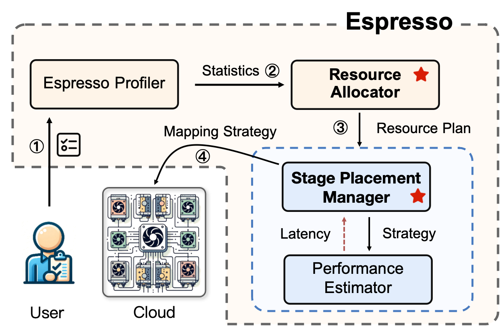

# Espresso

Espresso is a cost-efficient resource provisioning framework that unifies the heterogeneous GPU allocation(GPU allocator) and adequate stage placement (stage placer) for large model training in the cloud. 

## Overview

Espresso Profiler, GPU Allocator, Stage Placer, and Performance Estimator. Users first submit training jobs to the Espresso Profiler, which includes the model, SLO, and dataset. The Profiler analyzes the execution time and memory overhead for different layers on various GPU types. The analysis results are then passed to the GPU Allocator, which is responsible for generating cost-effective allocation plans for user’s training job in heterogeneous environments. According to the GPU allocation plan, the Stage Placer is invoked to obtain the stage placement plan, combined with the Performance Estimator to predict the required training time. Finally, the plan is executed in the cloud.




## Getting Started

### Prerequisites

Ensure you have the following dependencies installed:

- Python 3.8.0
- Torch 2.1.0
- Deepspeed 0.13.1
- Megatron-core 0.2.0
- Peft 0.4.0
- Transformers 4.32.0
- Flash-attn 2.5.0

### Installation

Clone the repository and install the required packages:

```bash
git clone https://github.com/Espresso111/Espresso.git
cd Espresso
pip install -r requirements.txt
```

### Running the Prototype System

To run Espresso, begin by creating a JSON configuration file for your model. Here is an example configuration for the model `open_llama_3b_v2`:

```json
{
    "model_name":"open_llama_3b_v2",
    "gradient_accumulation_steps":4,
    "seq_len":3000,
    "model_layer":26,
    "global_batch_size":64,
    "dp_size":1,
    "tp_size":1,
    "num_layers": 26,
    "n_head": 32,
    "hidden_dim": 3200,
    "vocab_size": 32000,
    "max_seq_len": 8000,
    "slo":100
}
```

The following Python script demonstrates how Espresso uses this configuration file to generate an effective GPU allocation and stage placement strategy:

```python
from Espresso import GPUAllocator
from Espresso.utils import Model
import time, json

if __name__ == "__main__":
    with open('./open_llama_3b_v2.json', 'r') as f:
        model = Model(**json.load(f))
    min_cost = GPUAllocator.gpu_allocator(model)
    with open("./result.json", "w") as f:
        f.write(json.dumps(min_cost))
```

After execution, the following `result.json` file is generated in the current directory:

```json
{
    "model_name": "open_llama_3b_v2",
    "gpus_permutation": [
        "a6000-pcie4-48gb",
        "a6000-pcie4-48gb",
        "3090-pcie4-24gb"
    ],
    "tp_size": 1,
    "pp_size": 3,
    "dp_size": 1,
    "money_cost": 0.2019491016738102,
    "time_cost": 50.13908731211839,
    "layer_distribution": [
        11,
        12,
        3
    ],
    "success": true
}
```

### Example

We provide a Python script for generating a configuration strategy for `open_llama_3b_v2`. Execute the following commands:

```bash
cd examples/open_llama_3b_v2
python open_llama_3b_v2.py
```

The generated `result.json` will be similar to the above.

